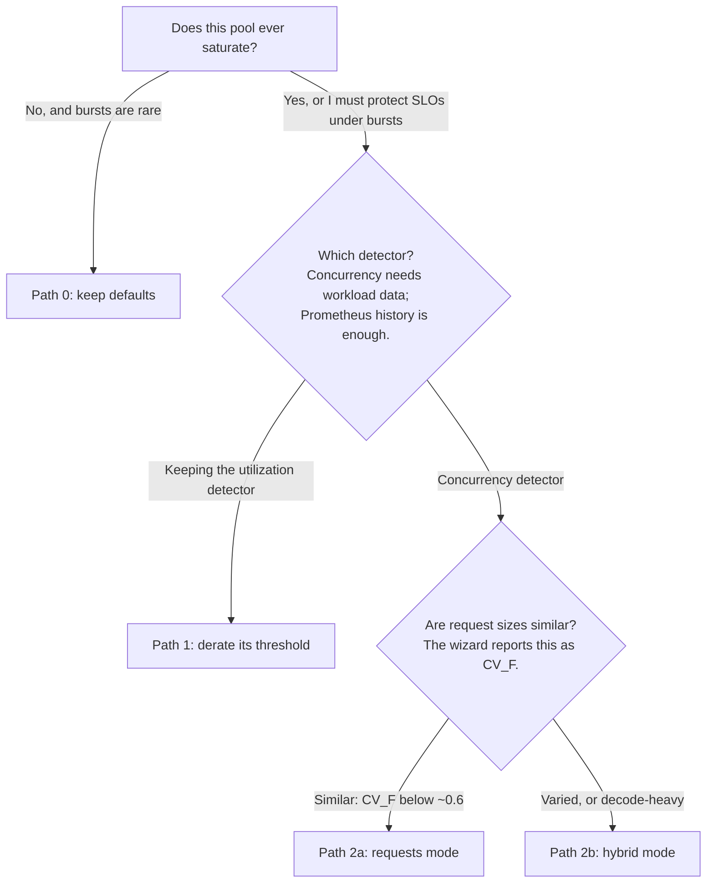

# Flow Control Tuning Guide

This guide answers one question: which saturation detector should this pool use, what value
should its limit hold, and how do you know the value is right?

Most of the work is done by the [tuning wizard](scripts/tuning_wizard.py). Run it with no
arguments and it asks about your workload, walks the decision tree below, and prints the
configuration to paste. The sections of this guide explain what it asks for, where each input
comes from, and how to check the result. The math lives in the companion
[tuning-theory.md](tuning-theory.md); you do not need it to follow this guide.

> [!NOTE]
> Flow control is a GA feature enabled explicitly (`featureGates: [flowControl]` in the
> EPP config; this guide's values file sets it). It is work-conserving: it never
> queues traffic a healthy pool can serve. If your pool never saturates, the defaults are
> already right, and Path 0 confirms that with three queries. If you tune and get the value
> wrong, the failure is loud and reversible: a counter climbs
> (`vllm:num_preemptions_total`), and the fix is lowering one number in a values file.

## Choosing a path



The wizard walks this same tree interactively:

```bash
python3 guides/flow-control/scripts/tuning_wizard.py
```

You do not need to score the CV_F branch before starting. The Path 2a and 2b commands differ
only in `--mode`; run either, and the wizard reports CV_F and says when to switch.

Every path below has the same shape: inputs, command, configuration, validation signal,
re-tune trigger.

## Path 0: confirm the defaults are enough

**Inputs:** a running deployment with
[monitoring](../../docs/operations/observability/setup.md).

**Check** these three series over your busiest available window:

```promql
max_over_time(llm_d_epp_flow_control_pool_saturation[7d])            # pass: peak < 0.8
sum_over_time((sum by (priority) (llm_d_epp_flow_control_queue_size) > bool 0)[7d:1m])   # pass: < ~30 (minutes with a queue, per band); hundreds fails
increase(vllm:num_preemptions_total[7d])                             # pass: < ~10 per replica (convention); steady growth fails
```

Seven days covering a traffic peak is ideal. A single busy day is enough to start. The first
two series need the EPP scraped by your monitoring stack (see the
[observability setup](../../docs/operations/observability/setup.md)); the third assumes your
scrape config keeps the `vllm:` metric prefix. Every `vllm:` query in this guide assumes the
vLLM backend this guide deploys. On SGLang, substitute the `sglang:` equivalents: retractions
are SGLang's preemptions (`sglang:num_retracted_requests_total`), and KV usage is
`sglang:token_usage`.

Two readings that look like failures but are not:

- The saturation query reads 1.0 for any window that includes a deploy or scale-up: a pool
  with zero ready endpoints reports saturation 1.0 by design (fail-closed). Start the
  window after the pool first served traffic, or expect this query to fail spuriously on
  young deployments.
- The queue query returning no rows means no queue has ever formed — a pass. The series
  only appears once a first request queues. If you expected rows, confirm the EPP target
  is up in your Prometheus before concluding anything.

If all three pass, the pool never reaches the regime where detector choice matters. Stop
here. Re-check when traffic grows.

Two defaults to know about even on this path:

- `defaultRequestTTL` is 60s: a request queued longer than that is shed. If your gateway or
  HTTPRoute timeout is shorter, clients see gateway 504s before the TTL acts. If your values
  set `requestTimeout: "0s"`, the TTL is the only shed valve. Align the two deliberately.
- The saturation signal trusts model-server metrics. An endpoint with stale metrics counts as
  fully saturated, and a pool where every endpoint goes stale halts dispatch until metrics
  return. This is fail-closed by design. Alert on scrape health as well as saturation:
  `pool_saturation` pinned at 1.0 while the pool is idle is the stale-metrics signature.

## Path 1: utilization detector (keeping the default detector)

The utilization detector reads the pool's measured state and acts on it roughly 300ms late
at defaults, so its threshold must leave room for what that delay admits
([derivation](tuning-theory.md#numbers-for-each-mode)). One thing to know before starting: if
Prometheus is scraping your model servers, Path 2's `--from-prometheus` needs no more access
than the queries below and gives the stronger detector. This path is for keeping the
utilization detector, not for lacking data.

**Inputs:** per-replica KV blocks and block size (engine startup logs or
`vllm:cache_config_info`), rough mean prompt and output lengths (response `usage` fields, or
the `vllm:request_prompt_tokens` / `vllm:request_generation_tokens` histograms), replica
count, and two observed rates:

```promql
# --dispatch-rate: peak pool admissions per second
max_over_time(sum(rate(vllm:request_success_total[5m]))[7d:5m])
# --decode-rate: tokens per second per active sequence
sum(rate(vllm:generation_tokens_total[5m])) / sum(avg_over_time(vllm:num_requests_running[5m]))
```

The delay is the EPP's own scrape of the model servers, not your Prometheus interval; do not
substitute it.

**Command:**

```bash
python3 guides/flow-control/scripts/tuning_wizard.py \
  --mode utilization \
  --gpu-blocks 21875 --block-size 16 \
  --isl-mean 4000 --osl-mean 800 \
  --endpoints 8 --dispatch-rate 200 --decode-rate 20
```

**Expected output:** a derated `kvCacheUtilThreshold` to configure. **What wrong looks like:**
the wizard reports that the derating has consumed the threshold. That happens with high
admission rates and long prompts. It means no threshold can protect the pool through the
delay, and Path 2 is the answer.

This detector averages saturation across endpoints and oscillates when tuned to the cliff
edge; both behaviors, and why the derating margin must stay, are in the theory doc's
[utilization-detector section](tuning-theory.md#numbers-for-each-mode).

**Validate / re-tune:** the same loop as every path. See
[Validation](#validation-the-preemption-budget-loop).

## Path 2: concurrency detector (workload data available)

The concurrency detector counts in-flight work itself, so its signal does not depend on
scraping the model servers. The count still propagates with a small lag: a cold burst
whose requests all arrive inside that lag dispatches past the limit before backpressure
engages (observed: a 100-connection burst against a 66-slot pool dispatched fully; ramped
arrivals were held at exactly the limit). Steady-state enforcement is exact. In exchange,
the detector needs a limit derived from your workload, and the wizard derives it. Give it
the best data source you have:

| Source | Input | Command fragment | What it buys |
|---|---|---|---|
| Benchmark run | `per_request_lifecycle_metrics.json` | `--from-benchmark <file>` | exact joint statistics, the tightest bound, a bootstrap confidence interval |
| Production log | per-request CSV (`isl,osl`) | `--trace workload.csv` | the same, from real traffic |
| Prometheus | vLLM metrics history | `--from-prometheus http://prom:9090 --window 7d` | no numbers typed; distributions and KV capacity pulled directly (`--print-queries` to run them yourself). Accuracy is bounded by histogram buckets: when most requests fall in one bucket, the variance collapses and the limit can come out **higher** than the trace tier's (measured: 27 vs 22 on a single-bucket workload). Cross-check with `--trace` before trusting it on narrow distributions |
| Summary statistics | means and standard deviations | `--isl-mean … --osl-std …` | closed forms under an assumed distribution; the weakest source |

Where these come from:

- **A benchmark run.** Every llm-d-benchmark inference-perf run writes
  `per_request_lifecycle_metrics.json` into its results directory; the profiles enable
  per-request records by default. If you have benchmarked this deployment with a
  representative workload, the strongest input is already on disk. If your clients set
  `max_tokens`, pass it as `--client-max-tokens`: some harness versions record
  impossible output counts for a small share of requests (input+output stored as
  output), and the flag rejects those rows instead of letting them widen the tail. The
  wizard warns when a trace looks affected either way.
- **Production traffic.** Every OpenAI-compatible response carries a `usage` field with
  `prompt_tokens` and `completion_tokens`. Log those two numbers at your API layer for a busy
  day and save them as two CSV columns. A few thousand rows spanning peak traffic beat a
  million rows of quiet time.

### Path 2a: `requests` mode (similar request sizes)

```bash
python3 guides/flow-control/scripts/tuning_wizard.py \
  --from-benchmark per_request_lifecycle_metrics.json \
  --gpu-blocks 21875 --block-size 16 \
  --mode requests --epsilon 0.001 --report tuning-report.html
```

One flag needs a decision: `--epsilon` is the target probability of overflowing KV memory.
0.001 is the wizard's default, and raising it trades preemption risk for admitted capacity.
It is a policy choice, not a measurement; keep the default unless you have a reason.

The wizard prints three things to act on:

- **The value to configure.** Use the LCB, the lower confidence bound that accounts for how
  much data you supplied, rather than the point estimate. The printed `maxConcurrency` is per
  endpoint and already includes the lookahead buffer.
- **A CV_F warning, if it applies.** CV_F measures how much per-request memory footprints
  vary. Above about 0.6, the safety margin gives up a meaningful share of capacity, and the
  wizard prints that share. Hybrid mode recovers most of it; move to Path 2b.
- **The two-walls check, if you supplied compute data.** A pool has a memory wall (KV cache)
  and a compute wall (the concurrency where inter-token latency degrades). Supply `--sweep`
  with `concurrency,tpot_ms` rows from a load test — concurrency **per endpoint**, not
  pool-wide; divide pool concurrency by the replica count first — or
  `--throughput`/`--latency-sec` (per-replica values) from an existing benchmark report,
  and the wizard names which wall binds. If the two diverge more
  than 15%, a memory-only limit carries inter-token-latency risk; record that in your runbook.
  The sweep must extend into the degradation regime: TPOT still flat at your top row means
  the data contains no knee, and the step between single-request and batched execution at
  the bottom of the ladder is not one. The wizard rejects a fit that lands on the sweep's
  lowest level, but it cannot detect a sweep that stopped short.

Merge the printed keys into your existing `pluginsCustomConfig`. The wizard prints only what
it derived: the detector plugin block and the `flowControl.saturationDetector` /
`defaultRequestTTL` entries. Keep your scorers, `schedulingProfiles`, and `priorityBands`. Do
not replace the whole block. Then apply:

```bash
helm upgrade ${GUIDE_NAME} ${ROUTER_STANDALONE_CHART} \
    -f ${REPO_ROOT}/guides/recipes/router/base.values.yaml \
    -f <your updated values file> \
    -n ${NAMESPACE} --version ${ROUTER_CHART_VERSION}
kubectl rollout restart deploy/${GUIDE_NAME}-epp -n ${NAMESPACE}
```

Re-supply every `-f` from your original install (for example
`monitoring.values.yaml`) — helm replaces the value set, and an omitted layer is an
uninstalled layer. The restart is required: the upgrade rewrites the config ConfigMap, but
the EPP reads it only at startup, so without a restart the old limit stays in force and
your validation measures the wrong config. Confirm the new value in the EPP log
(`grep maxConcurrency`). For about a minute after the restart the old EPP pod drains and
can still answer metrics scrapes with its stale state; wait for it to terminate before
reading the validation queries. If the new config misbehaves,
`helm rollback ${GUIDE_NAME} -n ${NAMESPACE}` (plus the same restart) restores the
previous release.

### Path 2b: `hybrid` mode (varied sizes, or decode-heavy)

```bash
python3 guides/flow-control/scripts/tuning_wizard.py \
  --from-benchmark per_request_lifecycle_metrics.json \
  --gpu-blocks 21875 --block-size 16 \
  --mode hybrid --epsilon 0.001 --report tuning-report.html
```

Hybrid guards both walls at once. `maxConcurrency` bounds batch slots and KV residency.
`maxTokenConcurrency` bounds booked tokens — and because output estimation books each
request's full estimated footprint for its whole lifetime, the wizard sizes this
ceiling in booked units anchored to the request wall. It is a guard against
unusually-long-prompt floods, not a second independent capacity limit; a ceiling sized
to raw KV capacity instead would silently bind ~25–30% below the request wall on
decode-heavy workloads. Both values are per endpoint. The emitted config enables
`addEstimatedOutputTokens` with an `outputRatio` calibrated from your data; never keep the
default 1.5 when the wizard prints a measured one.

> [!WARNING]
> Tokens mode without output estimation limits prefill only. The default accounting releases
> a request's tokens at its first output token, so under decode-heavy load it admits far past
> KV capacity. Do not deploy `concurrencyMode: tokens` with `addEstimatedOutputTokens: false`
> as the only saturation signal for a decode-heavy workload
> ([details](tuning-theory.md#numbers-for-each-mode)).

A cheap lever in every mode: clip `max_tokens` at your API layer for the requests that leave
it unset. Truncating the footprint tail tightens every bound
([why](tuning-theory.md#numbers-for-each-mode)). The in-flight estimator already honors
client caps.

## Validation: the preemption-budget loop

A wrong limit is neither silent nor permanent. The engine counts the exact event a too-high
limit causes (running out of KV and preempting), and the remedy is a one-line values change.
The configured limit claims that count stays flat at peak. Check the claim:

```promql
increase(vllm:num_preemptions_total[1h])        # target: ~0; a handful per week is noise
quantile_over_time(0.99, vllm:kv_cache_usage_perc[1h])    # target: under the watermark at peak
llm_d_epp_flow_control_queue_size               # >0 under load means the EPP is holding traffic
```

A note on units: the wizard's ε, the target probability of overflowing memory, is a fraction
of time spent at risk, while the preemption counter counts events. The two track each other
but are not the same quantity. Treat the counter as the pass/fail signal and ε as the design
target.

- Preemptions climbing: the limit or the capacity estimate is too high. Lower the limit by
  the gap between the wizard's point estimate and its LCB (in output like
  `N* = 118 (95% LCB; point 132)`, that step is 14), then re-observe.
- Preemptions at zero with KV p99 far below target: capacity is idle. Raise toward the
  wizard's point estimate, or revisit the mode choice if the CV_F warning fired.

**Re-tune** when the workload changes shape: after model, hardware, or replica-shape changes;
after engine upgrades that change KV accounting; and when traffic drifts from what you
measured. Climbing preemptions with no deploy in sight is the usual tell. If you want a
statistical drift trigger instead of a judgment call, the theory doc defines one
([re-tuning](tuning-theory.md#validation-and-re-tuning)).

## Operational notes

| Symptom | Likely cause | Where to look |
|---|---|---|
| Everything hangs, then 503/504s | zero ready endpoints (scale-up window) or all-endpoint stale metrics; both read as saturated and dispatch waits | endpoint readiness; scrape health; `pool_saturation` pinned at 1.0 |
| 429s with reason `queue full` | band or global `maxRequests`/`maxBytes` hit; this is memory protection, not saturation | `llm_d_epp_flow_control_queue_size` and `_queue_bytes` against the configured band limits; rejection counts in `llm_d_epp_flow_control_requests_total` by `outcome` |
| Sudden latency cliff at steady traffic | detector limit above true capacity, causing an engine preemption cascade | `num_preemptions_total`, KV p99 |
| Scheduler returns no endpoints under load | the concurrency detector's *filter* is fail-closed once every endpoint exceeds `capacity × (1 + headroom)` | detector config; consider modest `headroom` |
| Fairness/limits behave differently after scaling EPP | flow-control state is per-EPP-replica; bands and limits multiply by replica count, and fairness holds per replica | EPP replica count vs configured limits |

Notes:

- `headroom` is scheduling-filter slack. It lets high-affinity requests route to a busy
  endpoint. It does not loosen the saturation signal, and it is not a capacity knob.
- Per-band queue limits default to `maxRequests: 5000` and `maxBytes: 1G` on current routers.
  They gate enqueue, not dispatch, so size them for host memory. They are per EPP replica.
- Under flow control, use queue depth (`llm_d_epp_flow_control_queue_size`) as the
  autoscaling signal. It measures demand the pool declined, which utilization cannot show.

## Worked example: the guide's reference workload

The `maxConcurrency: 112` shipped in
[flow-control.values.yaml](router/flow-control.values.yaml) is re-derivable with this
procedure from the deployment it was measured on: Qwen3-32B, 8 replicas × TP2 on
H100-80GB (the engine reports 20,385 KV blocks × 16 tokens per replica in
`vllm:cache_config_info`), serving a shared-prefix workload of 64 prompt templates —
each request a 6,000-token cached prefix plus a ~1,200-token unique question, with
1,000-token outputs capped by client-side `max_tokens: 1000`.

The input is the strongest source in the table above: the
`per_request_lifecycle_metrics.json` a benchmark run of that workload leaves on disk.

```bash
python3 guides/flow-control/scripts/tuning_wizard.py \
  --from-benchmark per_request_lifecycle_metrics.json \
  --client-max-tokens 1000 \
  --gpu-blocks 20385 --block-size 16 \
  --shared-prefix 6000 --enable-prefix-caching --prefix-groups 64 \
  --endpoints 8 --mode requests --epsilon 0.001
```

Three flags carry the workload's structure, and each is a mistake to omit:

- `--shared-prefix 6000 --enable-prefix-caching`: prompt lengths in the records are
  full lengths, cached prefix included; the wizard applies the prefix discount itself.
  Do not subtract it from any input you supply, in any source.
- `--prefix-groups 64`: the workload keeps 64 distinct prefixes live, and each resident
  prefix occupies KV alongside request footprints. The wizard deducts a working set of
  `min(G, 2·⌈G/E⌉)` prefixes per endpoint; the 2× spill factor rounds up the residency
  measured under prefix-affinity routing
  ([provenance](tuning-theory.md#assumptions-and-failure-modes)). Omitting it on a
  multi-template workload produces preemptions at a limit the wizard called safe.
- `--client-max-tokens 1000`: rejects trace rows recording more output than the client
  cap allows — a known harness accounting bug fabricates a heavy output tail otherwise.

Expected output (abridged to the lines to act on):

```text
KV capacity per endpoint:  197,544 tokens (16 resident prefix(es) x 6000 tokens deducted from capacity)
In-flight footprint E[F]:  1,694 tokens  (CV = 0.17)
Memory wall (Chernoff):    N* = 110  (theta* = 1.21e-03, eps = 0.001)
Configure (LCB = lower confidence bound): N* = 110  (95% bootstrap LCB over 200 resamples)
Compute wall:              not measured  [!] memory-only limit carries TPOT risk
Per-endpoint limit:        110 + 2 = 112
```

The wizard emits `maxConcurrency: 112`: the 110-request memory wall plus a lookahead
allowance of 2. That is the value the guide ships.

The example shows three things. This workload is memory-bound — the compute wall is not
measurable because KV fills before inter-token latency finds a knee
([why](tuning-theory.md#numbers-for-each-mode)) — so the validation signal is the
preemption counter and KV p99, exactly the loop in
[Validation](#validation-the-preemption-budget-loop). The footprint is nearly
deterministic (CV_F = 0.17), the regime where `requests` mode is the right choice in
the decision tree. And on the deployment this example was measured on, each replica's
first engine preemption occurred at 107–135 concurrent requests — the derived limit
sits just inside that band, which is what ε = 0.001 buys.

If you change the model, hardware, replica shape, or the length distributions, re-derive
the number. The procedure is what transfers.
